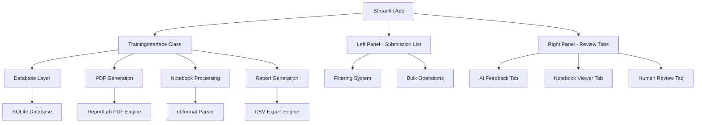

# AI Training Review Interface Design

## Overview

The AI Training Review Interface is a sophisticated Streamlit application that provides instructors with comprehensive tools for reviewing and correcting AI-generated homework grades. The system is designed around a dual-panel interface that maximizes efficiency while providing detailed review capabilities.

## Architecture

### High-Level Architecture



### Component Architecture

The system follows a modular design with clear separation of concerns:

1. **Presentation Layer**: Streamlit UI components
2. **Business Logic Layer**: TrainingInterface class
3. **Data Access Layer**: Database operations and file handling
4. **Report Generation Layer**: PDF and CSV export functionality

## Components and Interfaces

### 1. TrainingInterface Class

**Location**: `training_interface.py`

**Core Methods**:
```python
class TrainingInterface:
    def __init__(self, grader):
        """Initialize with database connection"""
        
    def get_assignments(self) -> List[Dict]:
        """Get list of assignments for selection"""
        
    def get_submissions(self, assignment_id: int) -> pd.DataFrame:
        """Get submissions for a specific assignment with AI scores"""
        
    def get_human_feedback(self, submission_id: int) -> Dict:
        """Get existing human feedback for a submission"""
        
    def save_human_feedback(self, submission_id: int, score: float, feedback: str):
        """Save human feedback and update training data"""
        
    def get_notebook_content(self, notebook_path: str) -> Dict:
        """Parse and return notebook content for display"""
        
    def get_training_stats(self, assignment_id: int) -> Dict:
        """Calculate training statistics and AI performance metrics"""
        
    def generate_bulk_pdfs(self, submission_ids: List[int]) -> str:
        """Generate ZIP file with individual PDFs for selected submissions"""
        
    def export_to_csv(self, submissions: pd.DataFrame) -> str:
        """Export grading data to CSV format"""
```

### 2. Dual-Panel Layout System

**Left Panel (1/3 width)**:
- Submission list with inline editing
- Visual score indicators
- Filtering controls
- Bulk operation buttons

**Right Panel (2/3 width)**:
- Tabbed interface for detailed review
- Context-sensitive content based on selection

### 3. Notebook Display Engine

**Interactive Notebook Viewer**:
```python
def display_interactive_notebook(notebook_path: str, mode: str = "full"):
    """
    Display notebook content in specified mode
    
    Args:
        notebook_path: Path to the notebook file
        mode: "full", "code_only", or "summary"
    
    Returns:
        Rendered notebook content with proper formatting
    """
```

**Supported Cell Types**:
- Code cells with syntax highlighting
- Markdown cells with HTML rendering
- Output cells (stream, execute_result, display_data, error)
- Raw cells with proper formatting

### 4. PDF Generation System

**Centralized Report Generation**:
```python
def generate_student_report_centralized(
    student_name: str,
    assignment_name: str,
    grading_result: Dict,
    human_feedback: Optional[Dict] = None
) -> str:
    """
    Generate comprehensive PDF report for a single student
    
    Returns:
        Path to generated PDF file
    """
```

**Report Components**:
- Header with student and assignment information
- Score summary with visual indicators
- AI feedback sections (if available)
- Human feedback sections (if provided)
- Technical analysis and code suggestions
- Recommendations for improvement

## Data Models

### Database Schema Extensions

**New Tables**:
```sql
-- Human feedback and corrections
CREATE TABLE human_feedback (
    id INTEGER PRIMARY KEY AUTOINCREMENT,
    submission_id INTEGER,
    human_score REAL,
    human_feedback TEXT,
    instructor_id TEXT,
    created_date TIMESTAMP DEFAULT CURRENT_TIMESTAMP,
    FOREIGN KEY (submission_id) REFERENCES submissions (id)
);

-- Training statistics tracking
CREATE TABLE training_stats (
    id INTEGER PRIMARY KEY AUTOINCREMENT,
    assignment_id INTEGER,
    ai_accuracy REAL,
    human_corrections INTEGER,
    avg_score_difference REAL,
    calculated_date TIMESTAMP DEFAULT CURRENT_TIMESTAMP,
    FOREIGN KEY (assignment_id) REFERENCES assignments (id)
);
```

### Data Flow Models

**Submission Data Structure**:
```python
{
    "id": int,
    "student_name": str,
    "student_id": str,
    "assignment_id": int,
    "notebook_path": str,
    "ai_score": float,
    "ai_feedback": dict,
    "human_score": Optional[float],
    "human_feedback": Optional[str],
    "submission_date": datetime,
    "review_status": str  # "unreviewed", "reviewed", "modified"
}
```

**Training Statistics Structure**:
```python
{
    "total_submissions": int,
    "reviewed_submissions": int,
    "avg_ai_score": float,
    "avg_human_score": float,
    "score_correlation": float,
    "component_accuracy": {
        "technical": float,
        "business": float,
        "analysis": float,
        "communication": float
    },
    "improvement_trends": List[Dict]
}
```

## Error Handling

### Error Categories and Responses

1. **File System Errors**:
   - Missing notebook files: Display error message with file path
   - Permission issues: Provide clear instructions for resolution
   - Disk space issues: Alert with cleanup suggestions

2. **Database Errors**:
   - Connection failures: Automatic retry with exponential backoff
   - Query failures: Log error and provide user-friendly message
   - Transaction conflicts: Implement proper locking mechanisms

3. **PDF Generation Errors**:
   - Template issues: Fallback to basic template
   - Content encoding problems: Sanitize input and retry
   - File size limits: Implement content truncation with warnings

4. **Session State Errors**:
   - Widget key conflicts: Use unique prefixes for all components
   - State corruption: Implement state validation and recovery
   - Memory issues: Implement proper cleanup procedures

### Error Recovery Strategies

```python
def safe_operation(operation_func, fallback_func=None, max_retries=3):
    """
    Execute operation with automatic retry and fallback
    
    Args:
        operation_func: Primary operation to attempt
        fallback_func: Fallback operation if primary fails
        max_retries: Maximum number of retry attempts
    
    Returns:
        Operation result or fallback result
    """
```

## Testing Strategy

### Unit Testing

**Core Components to Test**:
- TrainingInterface methods
- Notebook parsing functions
- PDF generation pipeline
- CSV export functionality
- Database operations

**Test Categories**:
- Happy path scenarios
- Error conditions and edge cases
- Performance under load
- Data integrity validation

### Integration Testing

**System Integration Tests**:
- End-to-end workflow testing
- Database transaction integrity
- File system operations
- Multi-user scenarios

### User Acceptance Testing

**Testing Scenarios**:
- Instructor workflow simulation
- Bulk operation testing
- Report generation validation
- Performance benchmarking

## Performance Considerations

### Optimization Strategies

1. **Lazy Loading**:
   - Load notebook content only when selected
   - Defer expensive operations until needed
   - Implement progressive loading for large datasets

2. **Caching Strategy**:
   - Cache parsed notebook content
   - Store computed statistics
   - Implement intelligent cache invalidation

3. **Database Optimization**:
   - Use appropriate indexes
   - Implement connection pooling
   - Optimize query patterns

4. **Memory Management**:
   - Clean up temporary files
   - Implement proper garbage collection
   - Monitor memory usage patterns

### Performance Targets

- **Page Load Time**: < 2 seconds for initial load
- **Submission Switch**: < 500ms for context switching
- **PDF Generation**: < 5 seconds per individual report
- **Bulk Operations**: Progress updates every 2 seconds
- **CSV Export**: < 10 seconds for 100 submissions

## Security Considerations

### Data Protection

1. **Input Validation**:
   - Sanitize all user inputs
   - Validate file paths and names
   - Implement proper SQL injection protection

2. **File System Security**:
   - Restrict file access to designated directories
   - Validate file types and sizes
   - Implement proper permission checks

3. **Session Management**:
   - Implement proper session isolation
   - Validate user permissions
   - Implement timeout mechanisms

### Privacy Considerations

- Student data anonymization options
- Secure temporary file handling
- Audit logging for sensitive operations
- Compliance with educational data privacy regulations

## Deployment Considerations

### Environment Requirements

- Python 3.9+
- Streamlit 1.28+
- SQLite 3.35+
- ReportLab 4.0+
- nbformat 5.7+

### Configuration Management

```python
# config.py
TRAINING_CONFIG = {
    "max_bulk_operations": 100,
    "pdf_timeout_seconds": 30,
    "cache_ttl_minutes": 15,
    "temp_file_cleanup_hours": 24,
    "max_notebook_size_mb": 10
}
```

### Monitoring and Logging

- Performance metrics collection
- Error rate monitoring
- User activity logging
- System resource utilization tracking