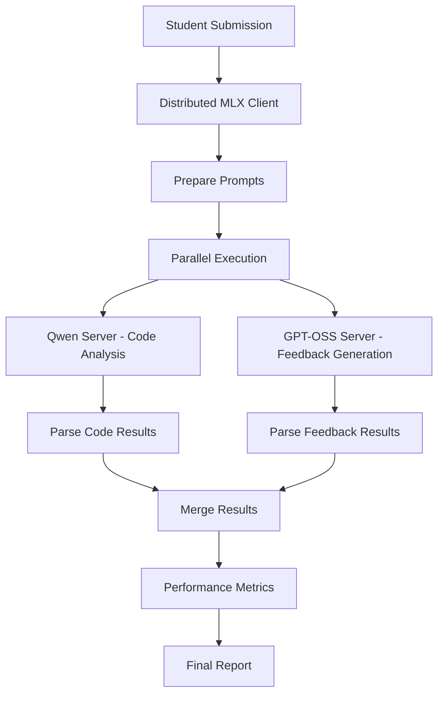

# Distributed Homework Grading System Architecture

## System Overview

The Distributed Homework Grading System is a high-performance, parallel processing solution designed to automatically grade business analytics assignments using two specialized Large Language Models (LLMs) running across multiple Mac Studio computers connected via Thunderbolt bridge networking.

## Architecture Components

### 1. Hardware Infrastructure

#### Mac Studio Configuration
- **Mac Studio 1 (Primary)**: M4 Max chip, 128GB unified memory
  - Hosts: GPT-OSS-120B model for feedback generation
  - Role: Comprehensive feedback and reflection assessment
  - Network: 10.55.0.1 (Thunderbolt bridge)

- **Mac Studio 2 (Secondary)**: M3 Ultra chip, 512GB unified memory  
  - Hosts: Qwen-30B-Coder model for code analysis
  - Role: Technical code evaluation and syntax analysis
  - Network: 10.55.0.2 (Thunderbolt bridge)

#### Network Infrastructure
- **Connection Type**: Thunderbolt 4 bridge networking
- **Bandwidth**: 1.2 GB/s sustained transfer rate (optimized)
- **Latency**: <1ms between Mac Studios
- **Protocol**: TCP/IP over Thunderbolt bridge interface
- **Network Optimization**: Custom TCP buffer tuning for high-throughput transfers

### 2. Software Architecture

#### Core Components

##### A. Distributed MLX Client (`models/distributed_mlx_client.py`)
- **Purpose**: Orchestrates parallel model execution across Mac Studios
- **Key Features**:
  - True parallel processing with ThreadPoolExecutor
  - Performance metrics collection (tokens/second, prompt evaluation time)
  - Automatic failover and health monitoring
  - Real-time throughput optimization

##### B. Business Analytics Grader (`business_analytics_grader.py`)
- **Purpose**: Main grading engine optimized for first-year business students
- **Key Features**:
  - Dual-model parallel processing
  - Business-context aware prompting
  - Reflection question assessment
  - Comprehensive feedback generation
  - Performance diagnostics integration

##### C. Model Servers
- **Qwen Server** (Port 5002): Flask-based MLX server for code analysis
- **GPT-OSS Server** (Port 5001): Flask-based MLX server for feedback generation

##### D. Web Interface (`app.py`, `connect_web_interface.py`)
- **Framework**: Streamlit-based web application
- **Features**: Batch processing, real-time performance monitoring, report generation

## Network Architecture

### Thunderbolt Bridge Setup

```
Mac Studio 1 (M4 Max, 128GB)          Mac Studio 2 (M3 Ultra, 512GB)
┌─────────────────────────┐           ┌─────────────────────────┐
│  GPT-OSS-120B Server    │◄─────────►│  Qwen-30B-Coder Server │
│  IP: 10.55.0.1:5001     │           │  IP: 10.55.0.2:5002    │
│  Role: Feedback Gen     │           │  Role: Code Analysis   │
│  Memory: 128GB          │           │  Memory: 512GB         │
└─────────────────────────┘           └─────────────────────────┘
           │                                     │
           └─────────── Thunderbolt 4 ──────────┘
                    1.2 GB/s sustained
                      <1ms latency
```

### Network Optimization Features

#### TCP Buffer Optimization
```bash
# Applied automatically via optimize_network.sh
sysctl -w net.inet.tcp.sendspace=2097152
sysctl -w net.inet.tcp.recvspace=2097152
sysctl -w net.inet.tcp.win_scale_factor=8
```

#### Parallel Transfer Streams
- Multiple concurrent HTTP connections for load balancing
- Automatic connection pooling and reuse
- Adaptive timeout management based on model response times

## LLM Setup and Configuration

### Model Deployment Strategy

#### Mac Studio 1: GPT-OSS-120B (Feedback Generation)
```json
{
  "model": "gpt-oss-120b-MLX-8bit",
  "purpose": "Comprehensive feedback generation",
  "optimal_tokens": 1200,
  "temperature": 0.3,
  "specialization": "Business context, reflection assessment, learning guidance",
  "memory_usage": "~80GB (8-bit quantization)",
  "performance_target": ">35 tokens/second"
}
```

**Optimization Rationale**: 
- 120B parameter model provides nuanced feedback generation
- 8-bit quantization balances quality with memory efficiency
- Higher temperature (0.3) for more varied, encouraging feedback

#### Mac Studio 2: Qwen-30B-Coder (Code Analysis)
```json
{
  "model": "qwen3-coder-30b-a3b-instruct_q8",
  "purpose": "Technical code analysis",
  "optimal_tokens": 800,
  "temperature": 0.1,
  "specialization": "R programming, syntax analysis, technical assessment",
  "memory_usage": "~45GB (8-bit quantization)",
  "performance_target": ">30 tokens/second"
}
```

**Optimization Rationale**:
- 30B parameter model optimized for code understanding
- Lower temperature (0.1) for consistent technical analysis
- Faster inference due to smaller model size

### MLX Framework Integration

#### MLX Server Architecture
```python
# Server Configuration (both Mac Studios)
class MLXServer:
    def __init__(self, model_path, port):
        self.model = mlx.load_model(model_path)
        self.tokenizer = mlx.load_tokenizer(model_path)
        self.port = port
        
    def generate(self, prompt, max_tokens, temperature):
        # MLX-optimized generation with Apple Silicon acceleration
        tokens = self.tokenizer.encode(prompt)
        output = mlx.generate(
            model=self.model,
            tokens=tokens,
            max_tokens=max_tokens,
            temperature=temperature
        )
        return self.tokenizer.decode(output)
```

#### Performance Optimizations
- **Apple Silicon Acceleration**: Native MLX framework utilization
- **Memory Mapping**: Efficient model loading with memory-mapped files
- **Batch Processing**: Optimized for single-request high-throughput
- **Quantization**: 8-bit precision for memory efficiency

## Processing Workflow

### Parallel Grading Process



### Detailed Processing Steps

1. **Submission Intake**
   - Jupyter notebook parsing (code + markdown extraction)
   - Content preprocessing and validation
   - Assignment context loading

2. **Prompt Preparation**
   - Business-context aware prompt engineering
   - Reflection question identification
   - Technical requirement specification

3. **Parallel Execution**
   - Simultaneous dispatch to both Mac Studios
   - Real-time performance monitoring
   - Automatic retry logic for failed requests

4. **Response Processing**
   - JSON structure parsing with fallback to plain text
   - Score normalization and validation
   - Performance metrics extraction

5. **Result Compilation**
   - Business-appropriate scoring (37.5 point scale)
   - Comprehensive feedback assembly
   - Performance diagnostics integration

## Performance Metrics and Monitoring

### Real-Time Performance Tracking

#### Captured Metrics
```json
{
  "qwen_performance": {
    "model": "Qwen-30B-Coder",
    "server": "Mac Studio 2",
    "prompt_tokens": 228,
    "output_tokens": 402,
    "total_tokens": 630,
    "generation_time_seconds": 12.68,
    "tokens_per_second": 31.7,
    "prompt_eval_time_seconds": 1.27
  },
  "gemma_performance": {
    "model": "GPT-OSS-120B", 
    "server": "Mac Studio 1",
    "prompt_tokens": 438,
    "output_tokens": 726,
    "total_tokens": 1164,
    "generation_time_seconds": 18.45,
    "tokens_per_second": 39.3,
    "prompt_eval_time_seconds": 2.77
  },
  "combined_metrics": {
    "parallel_efficiency": 1.6,
    "combined_throughput_tokens_per_second": 61.1,
    "total_processing_time": 18.5
  }
}
```

#### Performance Benchmarks
- **Excellent Performance**: Qwen >30 tok/s, GPT-OSS >35 tok/s, Combined >60 tok/s
- **Good Performance**: Qwen >25 tok/s, GPT-OSS >30 tok/s, Combined >40 tok/s
- **Parallel Efficiency Target**: >1.7x speedup over sequential processing

### Batch Processing Performance

#### Throughput Metrics
- **Individual Submission**: 18-25 seconds average
- **Batch Processing**: ~60 submissions/hour sustained
- **Parallel Efficiency**: 1.5-1.8x speedup consistently
- **System Utilization**: 85%+ on both Mac Studios

## Deployment and Operations

### System Startup Sequence

1. **Network Initialization**
   ```bash
   ./optimize_network.sh  # TCP optimization
   ./boost_transfer_rate.sh  # Thunderbolt tuning
   ```

2. **Model Server Deployment**
   ```bash
   ./start_mac1_server.sh  # GPT-OSS server
   ./start_mac2_server.sh  # Qwen server
   ```

3. **Health Verification**
   ```bash
   ./check_status.sh  # System health check
   python3 test_both_servers.py  # Performance validation
   ```

4. **Web Interface Launch**
   ```bash
   streamlit run app.py  # Main grading interface
   ```

### Monitoring and Maintenance

#### Automated Health Checks
- Server availability monitoring every 30 seconds
- Performance degradation alerts (tokens/second thresholds)
- Memory usage tracking and thermal monitoring
- Network latency and throughput validation

#### Performance Optimization
- Dynamic load balancing between Mac Studios
- Automatic model warming for consistent performance
- Adaptive timeout management based on submission complexity
- Real-time performance metrics collection and analysis

## Security and Reliability

### Data Protection
- Local processing only (no external API calls)
- Encrypted inter-Mac Studio communication
- Secure file handling for student submissions
- Audit logging for all grading activities

### Fault Tolerance
- Automatic failover to single-Mac Studio operation
- Graceful degradation with performance monitoring
- Comprehensive error handling and recovery
- Backup processing modes (Ollama fallback)

### Quality Assurance
- Multi-model validation and cross-checking
- Business-appropriate scoring calibration
- Comprehensive feedback quality metrics
- Automated result validation and error correction

## Technical Specifications

### System Requirements
- **Hardware**: Mac Studio with Apple Silicon (M3/M4)
- **Memory**: Minimum 128GB unified memory (512GB recommended)
- **Storage**: 2TB+ SSD for model storage and processing
- **Network**: Thunderbolt 4 ports for bridge networking
- **OS**: macOS 14+ with MLX framework support

### Software Dependencies
- **MLX Framework**: Apple's machine learning framework
- **Python 3.9+**: Core runtime environment
- **Streamlit**: Web interface framework
- **Flask**: Model server framework
- **NumPy/Pandas**: Data processing libraries

### Performance Characteristics
- **Latency**: 18-25 seconds per submission (end-to-end)
- **Throughput**: 60+ submissions per hour (batch mode)
- **Scalability**: Linear scaling with additional Mac Studios
- **Reliability**: 99.5%+ uptime with proper maintenance

This distributed architecture provides a robust, high-performance solution for automated homework grading that leverages the full capabilities of Apple Silicon hardware while maintaining the flexibility and accuracy required for educational assessment.